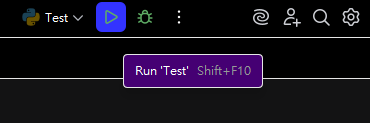
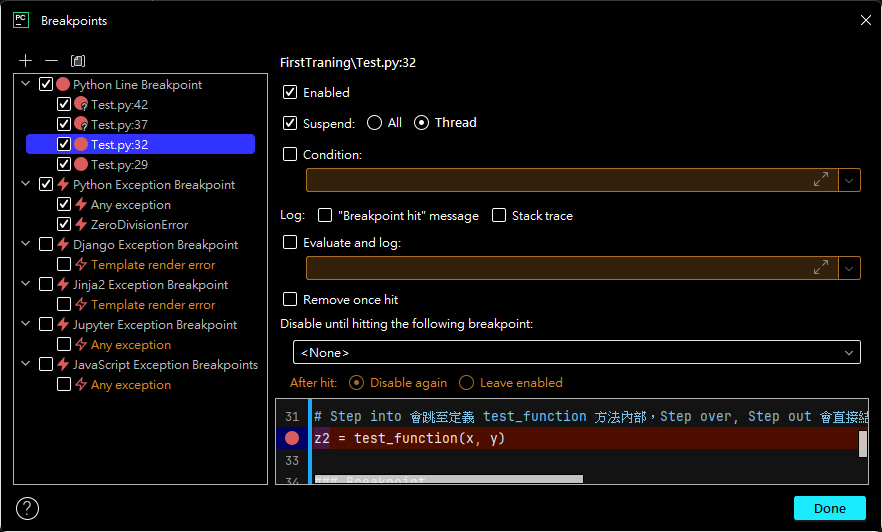
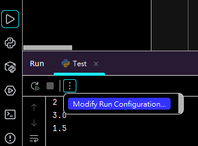
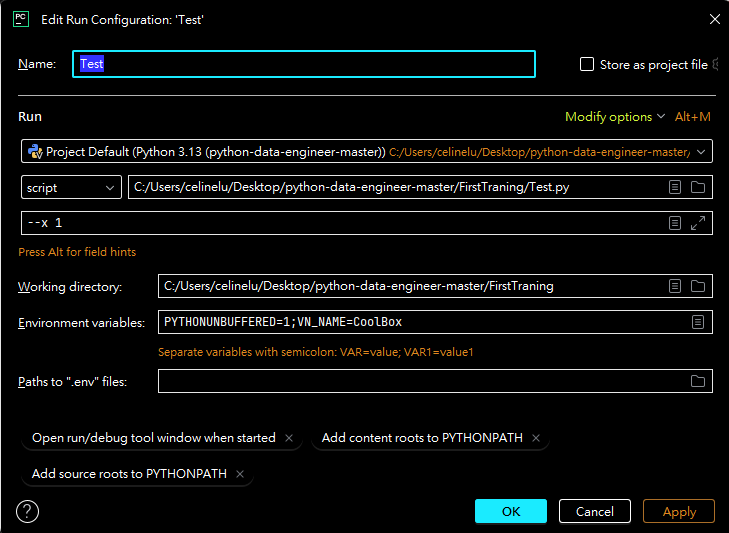
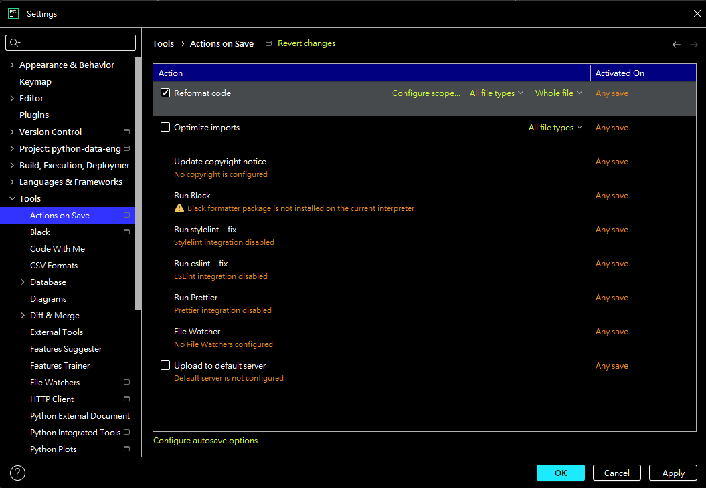
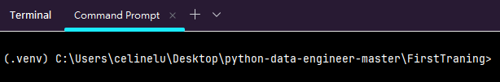

### Pycharm(IDE)

#### 部分功能補充在 PycharmTest.py

- 熟悉操作方式
    - 快捷鍵(Pycharm)：
        - Setting：ctrl+alt+s
        - 瀏覽近期檔案：ctrl+e
        - 複製(若沒選擇字串則為一整行)：ctrl+c
        - 複製並貼上該行：ctrl+d
        - 還原：ctrl+z
        - 重做：ctrl+shift+z
        - 刪除當前行(重做)：ctrl+y
        - 註解：ctrl+/
        - 縮排->：tab
        - 縮排<-：shift+tab
        - 重新命名(包括檔案、變數、方法)：shift+f6

- 執行程式的方式(一般執行)
    - 預設快捷鍵：shift+f10
  > 

- 執行程式的方式(偵錯方式)
    - breakpoint：
        - What? => 程式執行時「達到特定條件則暫停」的斷點
        - Why? => 目的為檢查與確定程式是否按照設計的邏輯進行
        - How? (預設快捷鍵：ctrl+shift+f8)
        - Line Breakpoints：程式抵達到該行時暫停，在 Pycharm 中可以額外設定啟用條件(Condition)
        - Exception Breakpoints：程式丟出特定例外時暫停，可以此得知錯誤當下的資料狀態和鄰近的程式碼
  > 

- 設定執行參數
    - What? => 執行程式時，隨著執行指令一同傳入的額外資訊
    - Why? => 接收從外部傳入的資料，根據條件不同進行不同的處理，增加程式使用靈活度
    - How? => 從 RUN 的面板 (預設快捷鍵：alt+4) 中，Modify Run Configuration 可以進行設定(如下圖)
  > 
  > 

- 快速尋找方法或參數的「源頭」或是「有哪些方法在使用」
    - 源頭：將輸入標放在要查詢的方法、參數上，點擊預設快捷鍵：ctrl+b，會自動跳到該項目的源頭位置
    - 有哪些方法在使用 => Find and replace，預設快捷鍵：ctrl+shift+f，可先將要尋找的字串選取再按快捷鍵

- 快速reformat程式碼：預設快捷鍵：ctrl+alt+l，可先將要 reformat 的程式碼選取後再按快捷鍵
    - 可以設定自動於儲存時 reformat
  > 

### Python程式開發

- 虛擬環境操作
    - 虛擬環境：
        - What? =>
        - Why? => 獨立的環境下，讓各專案在開發時套件獨立而互不衝突

    - 如何確認當前所在的虛擬環境為何?
        - 在虛擬環境 activate 的情況下，終端上會在當下目錄前提示目前所在的虛擬環境：(VENV_NAME)
  > 

    - requirements.txt 的意義為何，如何建立與使用
        - What? => 紀錄該 Python 專案需要的套件之文字檔
        - Why? => 專案共用、發佈、轉移時，為方便快速建立專案環境，可以直接利用 requirements.txt 列出的套件確保專案一致性
        - How? => 通常一行紀錄一個套件，為套件的名稱，若需要也可以加上套件的版本(用==分隔套件名與版本號，e.g.
          Django==5.1.1)
            - 可以手動於專案目錄建立，也可以使用 pip freeze 將當下環境的套件寫成 requirements.txt => pip freeze >
              requirements.txt
            - 可以使用 pip 安裝檔案中的套件 => pip install -r requirements.txt

- python基本練習
    - 如何執行一隻 python 程式
        - 從終端接收要求，決定要執行哪支程式(e.g. 透過命令列下指令：> python3 file.py)
        - 進到 Python 直譯器(interpreter) => 負責翻譯 Python 腳本(.py檔案)，將內容轉換為位元組碼(Byte Code)
            - Byte Code：執行過渡期產生的 Code，因其方便轉換，能跨平台、系統對接，省去重複編譯的步驟
        - 進到 Virtual Machine => 負責將接收的 Byte Code 解析成 Machine Code, Executable Code
        - 觸發 CPU 和其他系統去執行任務

    - 資料結構
        - Set
            - What? => 無序、不允許重複元素的資料結構
            - When? => 當只需保留資料種類，且與資料次序無關時使用
            - Where? =>
        - List (*Comprehension)
            - What? => 有序、可變、可重複元素的資料結構
            - When? => 當需保留以資料次序作為索引的資料集合，且資料需保留修改的靈活度時使用
            - Where? =>
        - Tuple
            - What? => 有序、不可變、可重複元素的資料結構
            - When? => 當需保留以資料次序作為索引的資料集合，且無修改資料需求時使用
            - Where? =>
        - Dictionary(*Comprehension)
            - What? => 無序、可變、鍵值對應的資料結構
            - When? => 當處理資料中具非資料次序之索引資料(key)，需保留其索引關係時使用
            - Where? =>

    - function
        - Positional Arguments(*args) 與 Keyword Arguments(**kwargs)
        - return 與 yield
        - Type Hints

    - Package及Module
        - 如何引用套件與使用套件
        - `if __name__ == '__main__'`的意義為何

    - 環境變數如何設定與讀取(從IDE、python-dotenv設定)
