_### Pycharm(IDE)

- 熟悉操作方式
    - 建立新 Python 專案 => File -> New Project
        - Interpreter type => 主要差異為 environment manager (conda, poetry...等等)
  > 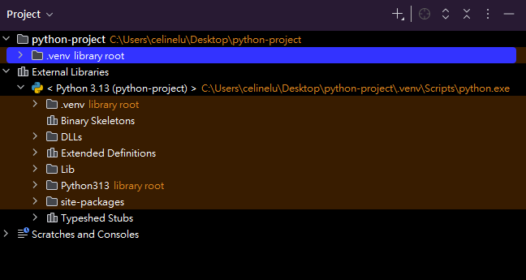

    - 新增檔案(e.g. Python File)
        - 在欲新增檔案的資料夾上右鍵 -> New -> Python File 或其他欲加入的檔案
  > 

    - 程式碼編寫
        - 快捷鍵(Pycharm)：
            - 複製並貼上該行：ctrl+d
            - 刪除當前行(重做)：ctrl+y
            - 註解：ctrl+/
            - 縮排->：tab
            - 縮排<-：shift+tab
            - 重新命名(包括檔案、變數、方法)：shift+f6

    - 設定 (預設快捷鍵：ctrl+alt+s) => 與 Pycharm 相關的設定，包括運行專案的環境
        - Project：該專案所處環境設置，包括 Python interpreter、Project Structure
  > 

- 執行程式的方式(一般執行) => 一般測試程式時
    - 預設快捷鍵：shift+f10
    - 執行結果將會顯示在 Run 的面板 (預設快捷鍵：alt+4) ，包括程式執行結果、錯誤訊息
  > 
  > 

- 執行程式的方式(偵錯方式) => 當遇到較複雜、不易解決的錯誤時(e.g. 邏輯型錯誤)，針對可能造成錯誤的程式區塊進行測試，以利找到問題的源頭
    - 預設快捷鍵：shift+f9
    - 執行過程中，運行當下的資料內容(變數)將會顯示在 Debug 的面板 (預設快捷鍵：alt+5) 的 Threads & Variables
    -
  > 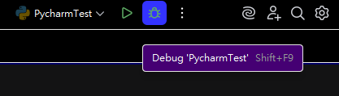
  > 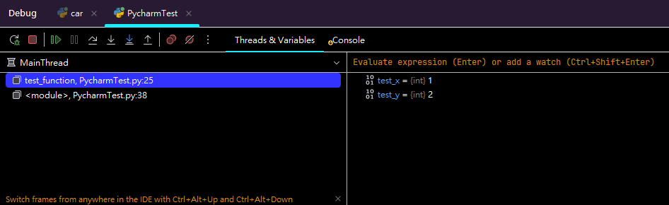
    - 下圖借用了 PyCharm 官方文件圖來說明
  > 

    - Debugger toolbar (官方圖中的第5項) => Debug 過程中控制程式碼流程，透過這列工具決定哪幾段程式會被檢查
        - 可自行調整各功能擺放位置(工具列上按右鍵，Customize Toolbar)
        - Rerun 'TheTest'：重新跑一次 Debug
        - Stop 'TheTest'：直接終止執行中的程式
        - Resume Program：點此將暫停執行的程式恢復運行
        - Pause Program：手動暫停執行中的程式，會在當下正在執行的那段停下(可能使用場景 e.g. 程式運行過久、無限迴圈)
        - Step Over：執行當行程式碼，但遇到該行程式碼中使用的方法，不會進入方法 Reference，直接執行至下行
        - Step Into：執行當行程式碼，並在遇到方法時，進入方法 Reference 執行
            - Step Into My Code：與 Step Into 差異在不會進入函式庫(當遇到在函式庫的方法時不會進入)，只會停留在自己的程式碼中
        - Step Out：當目前正在方法 Reference 中時，跳出方法並回到該方法被執行那行

    - Threads & Variables (官方圖中的第4、3項)
        - Threads => 執行續，在這裡會根據選擇的執行續，顯示執行續正暫停在程式碼的哪個區域位置
        - Variables => 變數，在這裡會根據選擇的執行續與區域位置，顯示該區域的變數
            - Evaluate expression (Enter)：根據輸入的表達式(e.g. 一個變數)回應 Result
              => 
            - add a watch (Ctrl+Shift+Enter)：有時程式碼較為複雜，可利用此功能追蹤想知道的內容(表達式)
              => 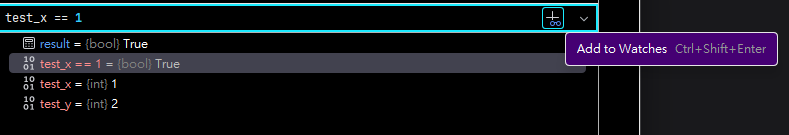
    - breakpoint：
        - What? => 程式執行時「達到特定條件則暫停」的斷點
        - Why? => 目的為檢查與確定程式是否按照設計的邏輯進行
        - How? (預設快捷鍵：ctrl+shift+f8)
        - Line Breakpoints：程式抵達到該行時暫停，在 Pycharm 中可以額外設定啟用條件(Condition)
        - Exception Breakpoints：程式丟出特定例外時暫停，可以此得知錯誤當下的資料狀態和鄰近的程式碼

- 設定執行參數
    - What? => 執行程式時，隨著執行指令一同傳入的額外資訊
    - Why? => 接收從外部傳入的資料，可根據條件不同執行不同的方法
    - How?
        - 腳本加入參數：使用 argparse 套件的 add_argument()
        - 設定 IDE 運行時要傳入的參數：從 Modify Run Configuration 可以設定要傳入的參數(如下圖)
  > 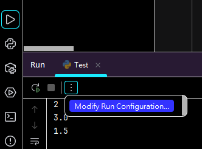
  > 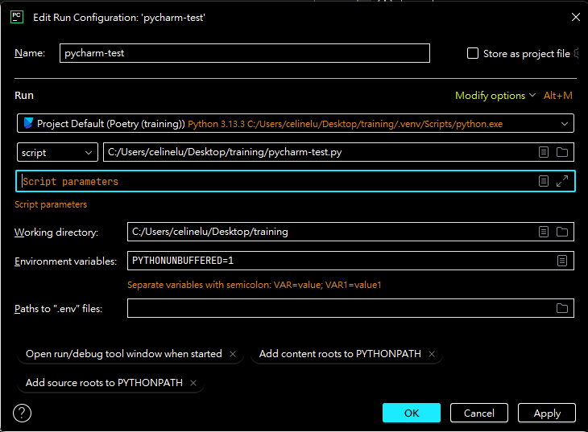

- 快速尋找方法或參數的「源頭」或是「有哪些方法在使用」
    - 源頭：將輸入標放在要查詢的方法、參數上，點擊預設快捷鍵：ctrl+b，會自動跳到該項目的源頭位置
    - 有哪些方法在使用 => Find and replace，預設快捷鍵：ctrl+shift+f，可先將要尋找的字串選取再按快捷鍵

- 快速reformat程式碼：預設快捷鍵：ctrl+alt+l，可先將要 reformat 的程式碼選取後再按快捷鍵
    - 可以設定自動於儲存時 reformat
  > 

### Python程式開發

- 虛擬環境操作
    - 虛擬環境：
        - What? => 獨立的開發環境，隔離不同專案
        - Why? =>
            1. 讓每個專案可以擁有自己的python版本和個別所需的套件，在開發時套件互不衝突
            2. 減少專案的轉移的成本(環境控管，轉移時更快速，較不易遺漏或搞錯套件版本)

    - 如何確認當前所在的虛擬環境為何?
        - 在虛擬環境 activate 的情況下，終端上會在當下目錄前提示目前所在的虛擬環境：(VENV_NAME)
          => 
        - 從設定 -> Project -> Python Interpreter 可以查看當前的專案環境下的 environment manager 與安裝套件

    - requirements.txt 的意義為何，如何建立與使用
        - What? => 紀錄該 Python 專案需要的套件之文字檔
        - Why? => 專案共用、發佈、轉移時，為方便快速建立專案環境，可以直接利用 requirements.txt 列出的套件確保專案一致性
        - How? => 通常一行紀錄一個套件，為套件的名稱，若需要也可以加上套件的版本(用==分隔套件名與版本號，e.g.
          Django==5.1.1)
            - 可以手動於專案目錄建立，也可以使用 pip freeze 將當下環境的套件寫成 requirements.txt => pip freeze >
              requirements.txt
            - 可以使用 pip 安裝檔案中的套件 => pip install -r requirements.txt
        - Poetry 套件管理 => 若要從 Poetry 匯出 requirement.txt，使用 poetry export 指令
          - poetry export --format requirements.txt --output requirements.txt
          (poetry export -f requirements.txt -o requirements.txt)
          - (--without-hashes：去掉雜湊碼)

- python基本練習
    - 如何執行一隻 python 程式
        - 從終端接收要求，決定要執行哪支程式(e.g. 透過命令列下指令：> python3 file.py)
            - 要求中包含：1.要用哪個 Python 直譯器(python3), 2.要跑哪個 Python 程式碼(file.py), 3.執行參數
            - IDE 透過 Run Configuration 去設定每一個腳本所使用的直譯器
          > 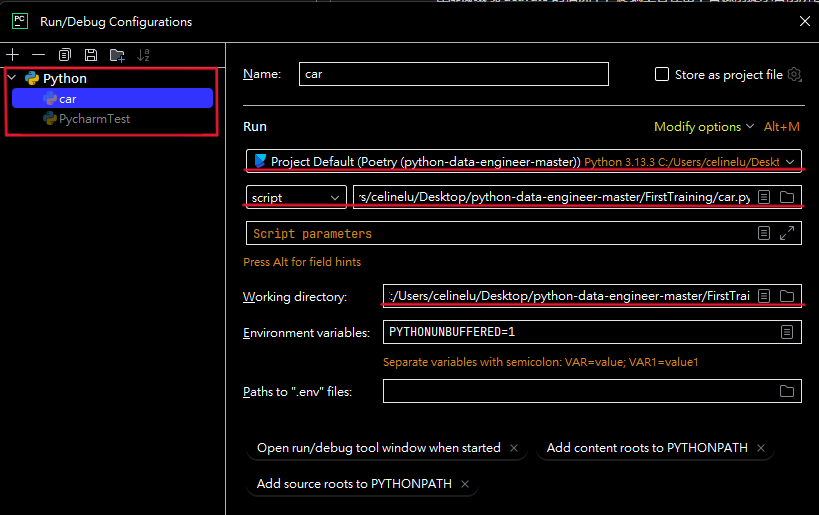
        - 進到 Python 直譯器(interpreter) => 負責翻譯 Python 腳本(.py檔案)，將內容轉換為位元組碼(Byte Code)
            - Byte Code：執行過渡期產生的 Code，因其方便轉換，能跨平台、系統對接，省去重複編譯的步驟
        - 觸發 CPU 和其他系統去執行任務

    - 資料結構(PythonTest)
        - Set
            - What? => 無序、元素唯一(未索引)的資料結構
            - Why? => 當需快速得到不重複資料(資料種類、特徵)，並以其做集合運算時適合使用，
              e.g. 從一張圖片中篩出有哪幾種顏色，並判斷「紅色」有沒有在該圖片裡
            - How? => {'color1','color2','color3'...}
        - List (*Comprehension)
            - What? => 有序、可變、可重複元素的資料結構
            - Why? => 當需保留以資料次序作為索引的資料集合，且資料需保留修改的靈活度時適合使用，e.g. 紀錄一張圖某段位置的顏色，並可以修改
            - How? => ['color1','color2','color3','color1'...]
        - Tuple
            - What? => 有序、不可變、可重複元素的資料結構
            - Why? => 當需保留以資料次序作為索引的資料集合，且無修改資料需求時適合使用，e.g. 快速儲存一張圖每個位置的顏色
            - How? => ('color1','color2','color3','color1'...)
        - Dictionary(*Comprehension)
            - What? => 無序、可變、鍵值對應且鍵唯一的複合型資料結構
            - Why? => 當需將標籤資料(key)與其他資料(value)相關聯，以方便後續重新取得資料時適合使用，e.g. 紀錄一張圖某個位置是什麼顏色
            - How? => {'point1': 'color1', 'point2': 'color1', 'point3': 'color2', 'point4': 'color3'}

    - function
        - Positional Arguments(*args) 與 Keyword Arguments(**kwargs)
            - 位置引數（Positional Arguments）
                - 沒有指定名稱的引數，會根據傳入位置分配給相對應位置的參數
            - 關鍵字引數（Keyword Arguments）
                - 指定名稱的引數，會根據名稱分配給相同名稱的參數
            - 如同函式語法「無預設值的參數需設定在具預設值的參數之前」，引數傳入時「位置引數需放在關鍵字引數的之前」
                - 原因：會出現「引數該分配給誰」的複雜問題
                - e.g. 當引數數量不足以分配給所有參數時，有預設值的參數被設定在沒有預設值的參數之前
                - e.g. 當前面的關鍵字引數已經將參數帶入，卻發現該參數相同的位置上有位置引數
            - 可變長度參數：不定長度的位置參數(*args)與關鍵字參數(**kwargs)
                - 當函數中有可能遇到需要傳「不固定數目」的參數值時使用，會在所有預設參數皆分配到引數後收集剩下的引數
                - *args：將收集到的 Positional Arguments 收集，以 Tuple 的方式保留
                - **kwargs：將收集到的 Keyword Arguments 收集，並以 Dict 的方式保留指定名稱(key)與值
        - return 與 yield
            - return：
                - What? => 運行函式時在遇到return位置將終止函式 => 最終回傳一個總結
                - When? => 當該方法結束的條件已被明確定義時
                - e.g. A方法中使用到迴圈累積資料，並且其他方法呼叫A方法時會直接處理整個資料(無須二次篩選)
            - yield：
                - What? => 運行函式時在遇到yield的位置「暫停」函式，紀錄後可再從前一次的暫停點繼續執行(調用next方法)
                  ，或選擇終止迭代 => 最終回傳一段過程(generator object)
                - When? => 當該方法結束的條件與方法外的因素相關聯時
                - e.g. A方法中使用到迴圈累積資料，但其他方法呼叫A方法時，可能不會使用到整個迴圈的資料(
                  其他方法擁有各自的條件判斷)，為提升效能(不用每次都跑完A方法的迴圈)可以使用 yield
        - Type Hints
            - What? => 用於提示函數輸入及輸出資料型態的註釋
                - 不影響程式碼運行，Python interpreter 會完全忽略 Type Hint
            - Why? => 增加該函數的使用方便性、可讀性及可維護性
            - How?
                - 輸入參數 "parameter: type"，輸出參數 "-> type"
                - e.g. def add_numbers(x: int, y: float) -> float
            - mypy：
                - 靜態類型檢查工具，協助檢查使用的方法型態是否符合 Type Hint 的註釋
      > 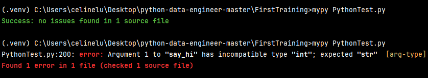

    - Package及Module
        - 模組(Module)：包含函式(Function)與類別(Class)的 Python file，目的為集中相關性較高的功能
        - 套件(Package)：包含了一個或多個的 Module 的資料夾，目的為整合與規劃 Module
        - 如何引用套件與使用套件
            - 將套件加入專案環境中(.venv -> Lib -> site-packages) => 可以使用 pip 安裝、升級和卸載 Python 套件
            - import：搜尋指定的模組(會去搜尋系統預設的 library路徑、當前的執行位置)，將找到的模組建立變數記錄下來，並執行每一行程式碼
            - 使用時根據 import 的名稱與範圍，一層層從 Package -> Module -> Function, Class, Variable 去呼叫需要的內容
        - `if __name__ == '__main__'`的意義為何：
            - __name__ 為模組名稱，當模組為直接被執行時為'__main__'，當被 import 進其他腳本時會被設定為模組檔名
            - 用於判斷當次執行時該模組是被引入的或直接被運行
            - 可藉此控制「哪些程式碼是外部在載入此腳本時不需執行的」，例如：用於測試、Debug 的程式碼
    - 環境變數如何設定與讀取(從IDE、python-dotenv設定)
        - What? => 與執行程式所處環境相關的參數
        - Why? => 專案開發過程中的環境可能產生變化，為方便變更而設定的參數
        - How? => 將環境變數存儲在 .env 檔案中 => 避免將敏感資訊硬編碼在程式碼裡(e.g. API 金鑰、資料庫連線資訊)
        - IDE
            - 從 Run Configuration 可以直接設定環境變數，或取得 .env 檔案的路徑
            - 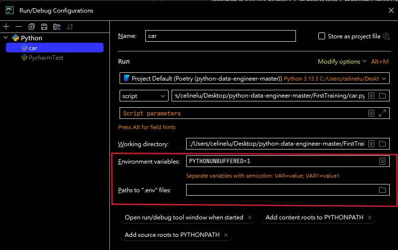
        - dotenv
            - load_dotenv(dotenv_path => .env檔案路徑) 方法載入 .env
        - 讀取：os.getenv("欲抓取的參數")

- python延伸練習
    - logging
        - 層級與意義
            - 六個level，包含：NOTSET、DEBUG、INFO、WARNING、ERROR、CRITICAL
              - DEBUG：針對欲解決之問題提供的細項訊息
              - INFO：確認程序正常執行的訊息
              - WARNING：用於警告有即將發生、未來可能發生問題的訊息
              - ERROR：發生的錯誤會造成程序某些功能無法執行時，提供的錯誤訊息
              - CRITICAL：發生的錯誤嚴重到程序無法繼續執行時，提供的錯誤訊息
            - logging.basicConfig(level => 設定欲輸出的最低層級)
            - 透過調控輸出的最低層級，可以針對不同的開發階段顯示需要的資訊，初期開發用Debug level，後期產品要上線時就可以直接設定
              WARNING level ，而不需從程式碼內部刪除
        - 如何輸出至console
            - logging.debug('Hello Debug')
            - logging.info('Hello info')
            - logging.warning('Hello WARNING')
            - logging.error('Hello ERROR')
            - logging.critical('Hello CRITICAL')
        - 如何輸出至file
            - logging.basicConfig(filename => 設定要儲存的日誌檔名, filemode => 設定儲存方式('a' -> append, 'w' ->
              write))
    - 命名規則（提示：字體大小寫、使用的詞性之類的）
        - Package 全小寫，文字串接的時候使用下底線（Snake Case）
        - Module 全小寫（Snake Case）
        - Class 開頭第一個單字大寫，其餘小寫，文字串接不使用下底線（Camel Case）
        - Function 全小寫（Snake Case）
        - Variable（Snake Case）
          - Local 全小寫、Globals 全大寫、常數全大寫

### git

- 什麼是git
    - 版本控管工具，控制與紀錄開發過程中不同版本的程式碼「快照」
  > 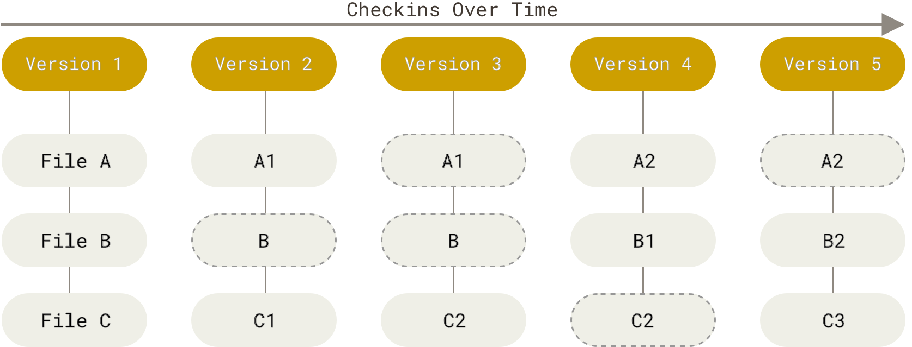
    - 工作區 \ 暫存區 \ 儲存區.git directory(Repository)
  > 

- 如何建立git repository
    - 全新的專案
        - 本地端：git init => 創建.git directory
        - 雲端：Github
      > 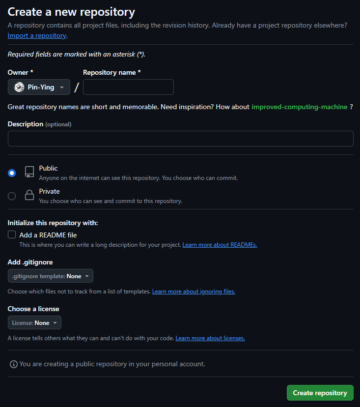

    - 已經有使用git版控的專案
        - 將該專案從本地->雲端
            - git remote
            - git push
        - 從雲端->本地端
            - git clone

- `.gitignore`的意義 => 紀錄專案中可被git無視的檔案(不需被控管、不會隨專案版本變化)
    - 與專案開發無直接關係 e.g. 中間檔、暫存檔
    - 較機密的檔案 e.g. 金鑰

- 如何進行提交(commit)
    - git add <FILE_NAME> => 將有變更(包括新增、刪除)的工作區檔案追蹤，移置暫存區
    - git commit -m "message，本次提交做了些什麼更動" => 將暫存區的檔案提交到儲存區(repository)

- 檔案還原
    - git restore <FILE_NAME> => 放棄工作區的修改，將檔案恢復到當前提交的狀態
    - git restore --source=<COMMIT_HASH_NUMBER> <FILE_NAME> => 放棄工作區的修改，將檔案恢復到指定提交的狀態
    - git restore --staged <FILE_NAME> => 將已經移交到暫存區的檔案退回工作區
    - git checkout -- <FILE_NAME> (git checkout HEAD <FILE_NAME>) => 放棄工作區的修改，將檔案恢復到當前提交的狀態
    - git reset <COMMIT_HASH_NUMBER> => 將提交退回到指定提交，修改的檔案回到工作區
    - git reset --hard <COMMIT_HASH_NUMBER> => 將提交退回到指定提交，修改的檔案也完全復原(工作區清空)
    - git revert <COMMIT_HASH_NUMBER> => 新增一個提交，以保留錯誤的提交的情況下，檔案狀態回復到指定提交

- 如何切換branch
    - git branch => 查看當前有哪些分支，以及正在哪個分支
        - git branch <NEW_BRANCH_NAME> => 新增分支
        - git branch -d <BRANCH_NAME> => 刪除分支
    - git switch <BRANCH_NAME> => 切換分支
    - git checkout <BRANCH_NAME> => 切換分支
    - git checkout -b <NEW_BRANCH_NAME> => 新增分支的同時切換到該分支

- 何為衝突(conflict)
    - 當兩版本在合併(merge)時，如果剛好在同一個檔案中皆有修改，Git無法判斷應保留哪個版本，同時無法自動將兩個版本合併(e.g.
      改到同一行程式碼)
    - 發生衝突時，Git會在該檔案中保留衝突的區段，將兩份檔案不同的地方標示出來，只要將檔案標示的修改完成後，重新提交即可解決衝突
> 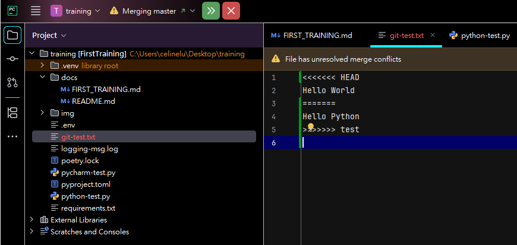
