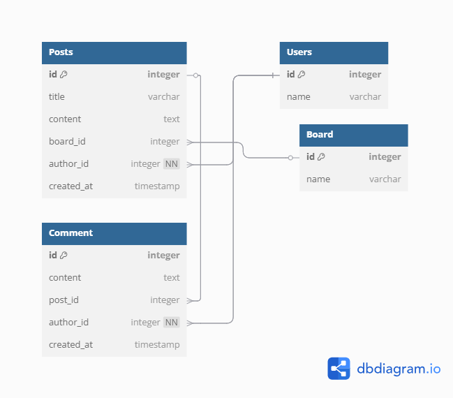

### 新人教育訓練： [FIRST_TRAINING.md](FIRST_TRAINING.md)

### 專案開發訓練：

紀錄：專案架構、運作流程、資料格式、如何部屬、執行方式

#### 系統規劃

- 系統架構
  - project-file
      - static
        - index.html
      - api
        - ppt.py
      - schema
        - ppt_content.py
      - model
        - ppt_content.py
      - db
        - base.py
      - tasks
        - celery_tasks.py
        - ptt_crawl.py
      - tests
        - test_crud.py
        - test_ptt_crawl.py
      - main.py

- 資料表設計
  > 
- 前端初期設計
  > 
  
- 運作流程圖
  > 
- 規劃時程表
  > 

- 環境需求
  - 資料庫種類：mariadb
- 部屬方式
  - docker-compose 

#### 專案呈現

- 爬蟲
  - PttCrawler 類別
    - 抓取每一個 board 的方法皆相同
    - 抓取每一文章列表的方法皆相同
    - 抓取每篇文章的方法皆相同
- 排程
  - Celery
- API
- 測試
- 前端
  > 
  > 
- 部屬
  - WebServer：Uvicorn