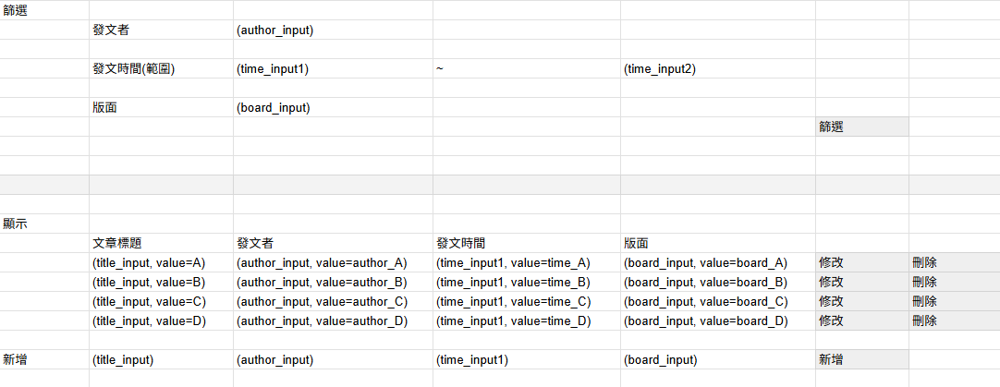
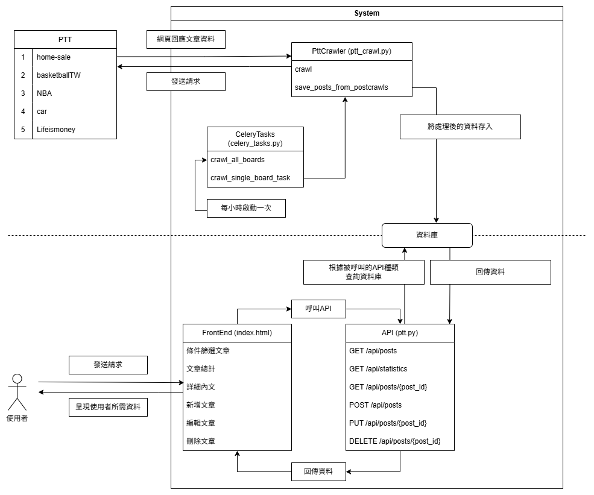
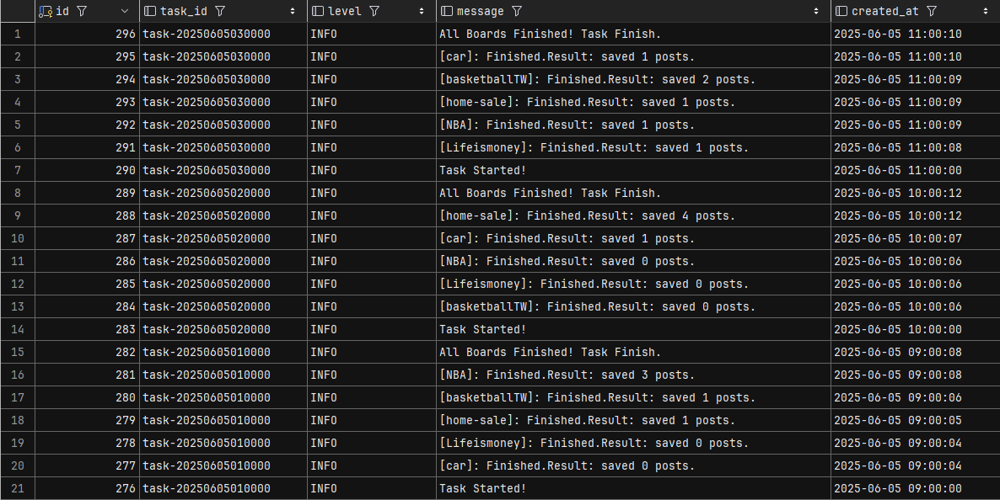

### 新人教育訓練： [FIRST_TRAINING.md](FIRST_TRAINING.md)

### 專案開發訓練：PTT WebServer

紀錄：專案架構、運作流程、資料格式、如何部屬、執行方式

#### 系統規劃

- 系統架構
  - project-file
      - static
        - index.html
      - api
        - ptt.py
      - schema
        - ptt_content.py
      - model
        - ptt_content.py
      - db
        - database.py
        - crud.py
      - tasks
        - celery_tasks.py
        - ptt_crawl.py
      - tests
        - test_crud.py
        - test_ptt_crawl.py
      - main.py

- 資料表設計
  > 
- 前端初期設計
  > 
  
- 運作流程圖
  > 
- 規劃時程表
  > 
- 部屬方式
  - docker-compose

#### 專案呈現

- Tasks (爬蟲與排程)
  - PttCrawler
  > 

  - Celery
    - Broker: Redis
    - celery beat => 設定每小時一次的 "crawl-ptt-every-hour" schedule
  > 
  
  - log
  > 

- API
  > 
- 前端
  > 
  > 
- 部屬
  - docker-compose.yml
    - redis: celery broker、celery result backend
    - mariadb: database
    - images build by Dockerfile
      - web: web server(FastAPI + uvicorn)
      - celery_worker: run tasks
      - celery_beat: schedule tasks
  - Dockerfile
    - 使用 Poetry 建立環境

