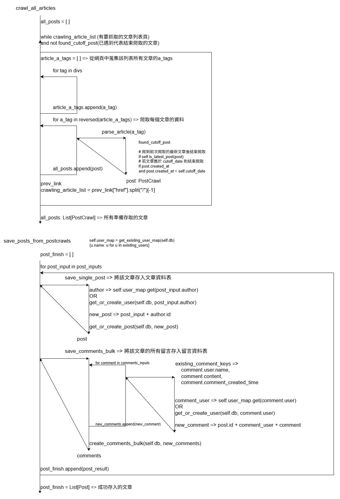

### 新人教育訓練： [FIRST_TRAINING.md](FIRST_TRAINING.md)

### 專案開發訓練：PTT WebServer

紀錄：專案架構、運作流程、資料格式、如何部屬、執行方式

#### 系統規劃

- 系統架構
  - project-file
      - static
        - index.html
      - api
        - ptt.py
      - schema
        - ptt_content.py
      - model
        - ptt_content.py
      - db
        - database.py
        - crud.py
      - tasks
        - celery_tasks.py
        - ptt_crawl.py
      - main.py

- 資料表設計
  > 
- 前端初期設計
  > 
  
- 運作流程圖
  > 
- 規劃時程表
  > 

#### 專案呈現

- Tasks (爬蟲與排程)
  - 目標：PTT五個版面的一年份資料，並每小時爬取新資料
  - Celery
    - celery beat => 設定每小時一次的 "crawl-ptt-every-hour" schedule
  > - 
  - PttCrawler
  > 

- API
  - 目標：提供使用者方便操作ptt資料庫的服務
  > 
  > 
- 前端
  > 
  > 
- 部屬
  - docker-compose => 管理專案所使用到的各項服務(images -> containers)，方便轉移專案時能夠快速地再次建立相同的環境
  > 

